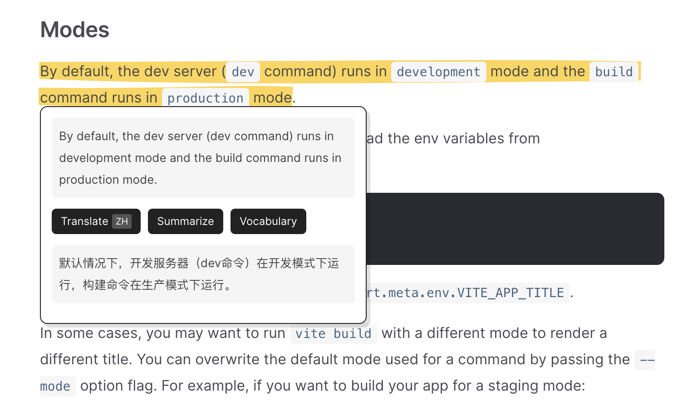

# NonoGPT for Annotation

NonoGPT for Annotation is a web annotation tool that integrates the abilities of ChatGPT, supporting functions such as translation, summarization, vocabulary learning, editing, and polishing.

NonoGPT for Annotation 是一个整合了 ChatGPT 能力的网页标注工具，支持翻译、总结、生词、汇总编辑、润色等功能。

## Features

🚧 Under construction

Latest update: [Twitter](https://twitter.com/CaptainMartinIO/status/1632430220656648192)

- [x] Annotation - 网页内容高亮标注
- [x] Translation - 网页内容翻译
- [x] Summarization - 网页内容总结
- [x] Speedy Translation for Paragraph - 网页段落快速翻译
- [x] Definition - 生词定义
- [x] Annotation Board - 标注汇总
- [ ] Vocabulary Notebook
- [ ] Export to X

## Preview

https://user-images.githubusercontent.com/24782674/223739890-6ac1dd36-5e8f-4fb9-a055-f763906d6c7a.mp4

